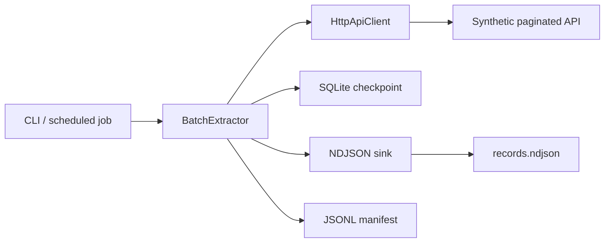

# Resumable API Batch Extractor

[](https://github.com/guilherme-lacerda-tech/resumable-api-batch-extractor/actions/workflows/ci.yml)
[](https://www.python.org/)
[](https://github.com/guilherme-lacerda-tech/resumable-api-batch-extractor/releases)
[](LICENSE)

A production-style batch extraction lab for cursor-paginated APIs. It demonstrates resumable checkpoints, retryable HTTP reads, idempotent NDJSON writes, deterministic synthetic API simulation and a clean-room .NET Worker Service implementation without using any real service, customer system or private dataset.

## Why This Project Exists

Many support and operations tools need to extract large API datasets without losing progress when rate limits, network errors or interrupted jobs happen. This repository shows that workflow as a small, inspectable Python implementation:

- Cursor-based pagination.
- SQLite checkpoint state.
- Retry on transient `429` and `5xx` responses.
- Idempotent output that skips records already written.
- Append-only JSONL manifest for extraction runs and failure injection.
- Demo API powered by `httpx.MockTransport`.
- Unit tests for resume, retry, contract validation, failure injection and CLI behavior.
- Independent .NET Worker Service using `BackgroundService`, `HttpClient`/`IHttpClientFactory`, SQLite checkpoint, manifest and xUnit tests.

## Architecture

See [docs/architecture.md](docs/architecture.md) for the technical overview and [docs/shared-specification.md](docs/shared-specification.md) for the clean-room contract shared by Python and .NET.



## Quick Start

```bash
python -m pip install -e ".[dev]"
python examples/run_demo.py
```

Run the CLI directly:

```bash
resumable-extractor-demo --total-records 125 --page-size 25 --output output.ndjson --checkpoint state.sqlite3
```

Expected shape:

```json
{
  "completed": true,
  "pages_read": 5,
  "records_written": 125,
  "last_cursor": null,
  "resumed": false
}
```

More usage examples are in [docs/usage-examples.md](docs/usage-examples.md).

## Validation

```bash
python -m ruff check .
python -m pytest --cov --cov-report=term-missing -q
dotnet build dotnet/ResumableExtractorCleanRoom.slnx --configuration Release
dotnet test dotnet/ResumableExtractorCleanRoom.slnx --configuration Release --no-build
```

The coverage gate is set to 88%.

## Failure Model

The extractor updates output and checkpoint separately. If a process stops after a page is written but before a checkpoint advances, the next run can read the same page again. The NDJSON sink tracks already-written record IDs and skips duplicates, keeping resumed runs idempotent.

The current failure injection matrix covers `429`, `500`, `503`, timeout, connection reset, partial JSON payload, invalid payload, crash after write before checkpoint, crash after checkpoint, restart, incomplete output cache, corrupt output cache and exhausted rate limit budget.

See [docs/failure-injection-matrix.md](docs/failure-injection-matrix.md) for the scenario-by-scenario expected result, manifest event, checkpoint behavior, duplicate behavior and recovery path.

See [docs/adr/0001-checkpoint-and-idempotent-output.md](docs/adr/0001-checkpoint-and-idempotent-output.md) for the design decision behind this model.

## Benchmark

Run the Python benchmark:

```bash
python benchmarks/python_benchmark.py --sizes 10000 100000 --page-size 5000 --repeat 1 --output benchmarks/results/python_benchmark_local.json
```

Run the .NET benchmark:

```bash
dotnet run -c Release --project dotnet/benchmarks/ResumableExtractor.Benchmarks/ResumableExtractor.Benchmarks.csproj -- --sizes 10000 100000 --page-size 5000 --output benchmarks/results/dotnet_benchmark_local.json
```

Measured locally on 2026-08-21:

| Stack | Records | Page size | Duration | Records/s | Pages/s | CPU seconds | RSS after | Checkpoint overhead | Resume duration |
|---|---:|---:|---:|---:|---:|---:|---:|---:|---:|
| Python | 10,000 | 5,000 | 0.282s | 35,442 | 7.09 | 0.141s | 48.4 MB | 0.049s / 20.8% | 0.167s |
| .NET Release | 10,000 | 5,000 | 0.337s | 29,632 | 5.93 | 0.250s | 56.9 MB | 0.179s / 112.5% | 0.102s |
| Python | 100,000 | 5,000 | 9.633s | 10,381 | 2.08 | 1.453s | 86.0 MB | 0.168s / 1.8% | 6.423s |
| .NET Release | 100,000 | 5,000 | 9.606s | 10,411 | 2.08 | 2.047s | 137.3 MB | 3.071s / 47.0% | 4.586s |

The 1,000,000-record matrix was not run in this session because the complete benchmark includes checkpoint, no-checkpoint and resume runs. The scripts support that size, but 100,000 records were enough to show the current implementation is dominated by local JSON/NDJSON serialization, mock transport and file I/O. .NET did not provide a decisive throughput advantage in this workload; the migration is justified as an architecture and Worker Service demonstration, not as a proven performance rescue.

## Repository Structure

```text
src/resumable_api_batch_extractor/
  checkpoint.py   # SQLite checkpoint persistence
  client.py       # HTTP page client with retry
  cli.py          # Synthetic demo command
  demo_api.py     # In-memory paginated API simulator
  extractor.py    # Resume orchestration
  manifest.py     # Optional append-only run manifest
  models.py       # Shared dataclasses
  writers.py      # Idempotent NDJSON output
benchmarks/
  python_benchmark.py
dotnet/
  src/ResumableExtractor.Worker/
  tests/ResumableExtractor.Tests/
  benchmarks/ResumableExtractor.Benchmarks/
tests/
  test_failure_matrix.py
  test_client.py
  test_extractor.py
  test_cli.py
```

## Security

This project is a public rewrite from scratch using only synthetic data. It does not contain real endpoints, credentials, tokens, customer names, private logs or internal schemas.

## Contributing

See [CONTRIBUTING.md](CONTRIBUTING.md).
