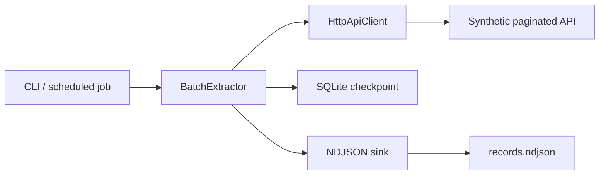

# Resumable API Batch Extractor

[](https://github.com/guilherme-lacerda-tech/resumable-api-batch-extractor/actions/workflows/ci.yml)
[](https://www.python.org/)
[](LICENSE)

A production-style batch extraction lab for cursor-paginated APIs. It demonstrates resumable checkpoints, retryable HTTP reads, idempotent NDJSON writes and deterministic synthetic API simulation without using any real service, customer system or private dataset.

## Why This Project Exists

Many support and operations tools need to extract large API datasets without losing progress when rate limits, network errors or interrupted jobs happen. This repository shows that workflow as a small, inspectable Python implementation:

- Cursor-based pagination.
- SQLite checkpoint state.
- Retry on transient `429` and `5xx` responses.
- Idempotent output that skips records already written.
- Demo API powered by `httpx.MockTransport`.
- Unit tests for resume, retry, contract validation and CLI behavior.

## Architecture



## Quick Start

```bash
python -m pip install -e ".[dev]"
python examples/run_demo.py
```

Run the CLI directly:

```bash
resumable-extractor-demo --total-records 125 --page-size 25 --output output.ndjson --checkpoint state.sqlite3
```

Expected shape:

```json
{
  "completed": true,
  "pages_read": 5,
  "records_written": 125,
  "last_cursor": null,
  "resumed": false
}
```

## Validation

```bash
python -m ruff check .
python -m pytest --cov --cov-report=term-missing -q
```

The coverage gate is set to 88%.

## Failure Model

The extractor updates output and checkpoint separately. If a process stops after a page is written but before a checkpoint advances, the next run can read the same page again. The NDJSON sink tracks already-written record IDs and skips duplicates, keeping resumed runs idempotent.

## Repository Structure

```text
src/resumable_api_batch_extractor/
  checkpoint.py   # SQLite checkpoint persistence
  client.py       # HTTP page client with retry
  cli.py          # Synthetic demo command
  demo_api.py     # In-memory paginated API simulator
  extractor.py    # Resume orchestration
  models.py       # Shared dataclasses
  writers.py      # Idempotent NDJSON output
tests/
  test_client.py
  test_extractor.py
  test_cli.py
```

## Security

This project is a public rewrite from scratch using only synthetic data. It does not contain real endpoints, credentials, tokens, customer names, private logs or internal schemas.

