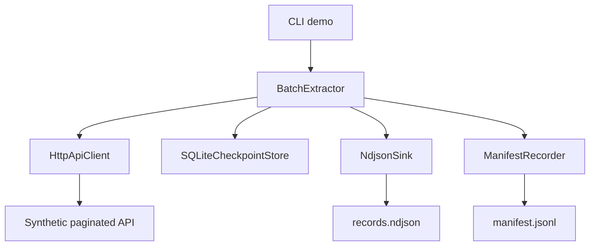
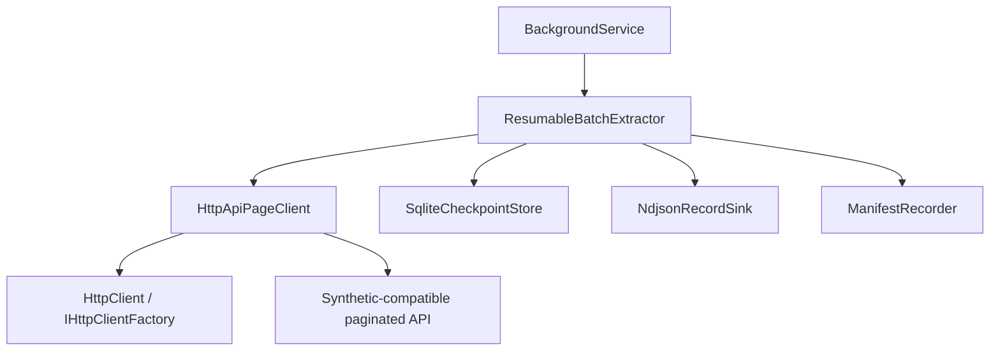

# Architecture

## Design Goal

Extract records from a cursor-paginated API in a way that survives transient failures and interrupted runs while keeping output idempotent.

## Components

### Python

### .NET Worker Service

The .NET implementation follows the shared contract in [shared-specification.md](shared-specification.md). It is not a line-by-line port of the Python code; it uses Worker Service hosting, dependency injection, `HttpClient`, `System.Text.Json`, SQLite and xUnit.

## Resume Model

1. The extractor loads the latest checkpoint for the job.
2. The HTTP client reads one cursor page with a bounded retry budget.
3. Records are appended to NDJSON only if their ID has not been written before.
4. The checkpoint advances after the page is processed.
5. If a run stops, the next run resumes from the saved cursor.

## Failure Windows

The implementation intentionally treats output and checkpoint as separate durable artifacts:

- If the process crashes after a write but before checkpoint save, the next run can replay the same page. The sink skips IDs that already exist in NDJSON and appends only missing records.
- If the process crashes after checkpoint save, the next run resumes from the saved cursor and does not read the already-checkpointed page again.
- If a completed checkpoint exists but the output file is missing records, the extractor records `output_incomplete`, resets the checkpoint and replays from the start. Existing IDs are skipped and missing IDs are appended.
- If an existing output file contains invalid NDJSON, the sink raises `OutputIntegrityError` before extraction starts. This avoids silently rebuilding a duplicate index from corrupt data.

## Manifest

`ManifestRecorder` is optional and writes append-only JSONL events such as `run_started`, `page_fetch_started`, `page_written`, `checkpoint_saved`, `checkpoint_completed`, `interrupted`, `page_fetch_failed`, `page_write_failed`, `output_incomplete` and `run_completed`.

The manifest is used by the failure injection tests to prove expected behavior around retry, checkpoint state, duplicate suppression and recovery.

## Concurrency Decision

Cursor pagination is naturally sequential because page `N + 1` depends on `next_cursor` returned by page `N`. The .NET implementation therefore does not add page-level concurrency. A bounded channel can be introduced later if the workflow grows into independent fetch, transform and write stages, but that is not proven necessary by the current benchmark.

## Benchmark Interpretation

At 100,000 synthetic records, Python and .NET Release are effectively tied for throughput in the local benchmark. .NET resume was faster in this run, while .NET working-set memory and checkpoint overhead were higher. The current bottleneck appears to be JSON/NDJSON serialization, mock transport and local file I/O rather than the language runtime alone.

## Boundaries

- The API simulator uses `httpx.MockTransport`; no external service is contacted.
- SQLite stores only extractor progress, not application domain data.
- NDJSON keeps the output easy to inspect with normal command-line tools.
- Duplicate skipping protects against replay when an interruption happens around checkpoint updates.
- Benchmarks use synthetic in-memory fixtures and local temporary output files.

