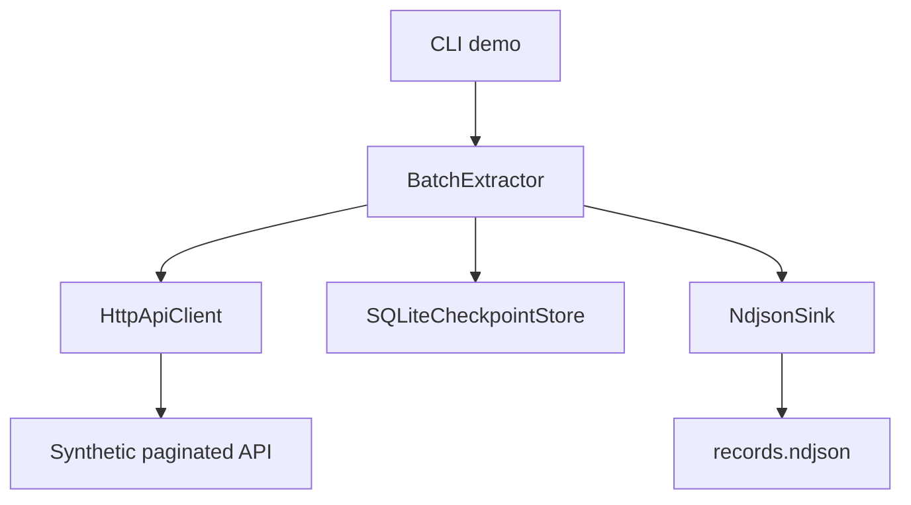

# Architecture

## Design Goal

Extract records from a cursor-paginated API in a way that survives transient failures and interrupted runs while keeping output idempotent.

## Components

## Resume Model

1. The extractor loads the latest checkpoint for the job.
2. The HTTP client reads one cursor page with a bounded retry budget.
3. Records are appended to NDJSON only if their ID has not been written before.
4. The checkpoint advances after the page is processed.
5. If a run stops, the next run resumes from the saved cursor.

## Boundaries

- The API simulator uses `httpx.MockTransport`; no external service is contacted.
- SQLite stores only extractor progress, not application domain data.
- NDJSON keeps the output easy to inspect with normal command-line tools.
- Duplicate skipping protects against replay when an interruption happens around checkpoint updates.

